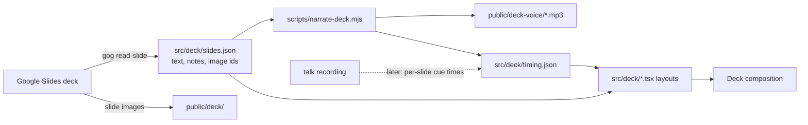

# PRD 3: Remotion deck

**Status:** active
**Owner:** MRF-WSL
**Created:** 2026-10-06
**Issue:** #3
**Approved-by:** Michael@2026-10-06T01:08:25Z
**Plan checksum:** sha256:29720f9c3c5f

> Approval semantics: while Status is `draft` the body below is editable
> in place. Once `/prd approve 3` is run, the body is sealed:
> `Approved-by:` records the approver and timestamp, and `Plan checksum:`
> records sha256 of the body (sections from `## Context` onward). After
> sealing, any change must go through `/prd amend 3`, which logs the diff
> to `decisions.md` and reverts Status to `draft` pending fresh approval.

## Context

The keynote "Governing MCP for a Workforce the Size of a City" is given at
MCP Dev Summit Toronto on 6 October 2026. Its deck lives in Google Slides
(`1kPEQ80oGdeE74VrZbXx5qHeyak8R3EuSB0hfF2RsDvg`): 39 live slides and 20
skipped ones. This repo already holds the shadow-play film, a five-minute
retelling of the talk in cut paper with a synthetic voice. Release v0.3 is
the current cut.

The film retells the talk in its own pictures. Someone who wants the
keynote as given, with the slides and the spoken words, has nothing to
watch.

## Problem

There is no video of the keynote in its own form. The deck is a static file
whose builds only exist when someone clicks through it, and its speaker
notes are invisible to anyone reading it. A venue recording, when it comes,
will be a camera on a stage with the slides small and out of focus behind
the speaker.

## Goals

- A video that shows every live slide of the deck in its own look, with the
  deck's builds (the ship ladder, the "what if" equation, the attack chain,
  the PowerShell and browser flows) animated in order.
- Every slide's on-screen text is the deck's text, unchanged.
- Each slide stays up exactly as long as its spoken words, from a voice
  track timed per slide.
- The voice track is swappable: the synthetic reading of the speaker notes
  first, the talk recording later, without rebuilding any slide.
- Both cuts render from this repo with one command each and ship as
  release assets.

## Non-Goals

- Presenting live from Remotion. Google Slides stays the presenting tool.
- Redesigning any slide. The deck is the source; the video follows it.
- Rendering the 20 skipped slides.
- Retiring the shadow-play film. It stays as the short companion piece.
- Editing camera footage of the speaker. If the recording is video, only
  its audio is used here; picture-in-picture is a follow-up PRD.

## Proposed Approach

- **Extraction.** A script pulls every live slide's text elements, speaker
  notes, and images through `gog slides read-slide` into
  `src/deck/slides.json` and `public/deck/`. Re-running it after a deck edit
  refreshes the data; the layouts do not change.
- **Layouts, not slide-per-file.** The deck uses a small set of shapes: a
  title slide, a header bar over a picture and a caption line, a row of
  numbered cards, a flow of numbered steps with arrows, a bulleted panel,
  the ship ladder, and a closing slide with QR codes. Each is one React
  component in the deck's look (navy bar, white body, summit mark, slide
  number). Each slide in `slides.json` names its layout.
- **Builds.** Consecutive slides that are builds of one picture (the ship
  ladder, the "what if" equation) render as one held frame that adds the new
  element, not as a cut.
- **Voice and timing.** The speaker notes are read verbatim, one clip per
  slide, by the same model and voice as the film. A timing file records each
  slide's length. A recording replaces the clips by supplying one audio file
  and a list of slide cue times; the layouts read timing only through the
  timing file, so nothing else changes.
- **Diagram slides** (the full architecture, the QR codes) use the deck's
  own rendered image rather than a rebuild, since a rebuild would be a
  second copy of a diagram that already has a source.

### Key decisions

- Verbatim notes, not condensed. The film condenses; this video is the talk.
- The deck's look, not the film's cut paper.
- Rebuild text as text, so it stays sharp at 1080p and can be corrected
  from the deck by re-extraction.

## Milestones

- **M1 Extract**: `slides.json` holds all 39 live slides with text, notes
  and layout name; every image the slides use is in `public/deck/`.
- **M2 Layouts**: every slide renders as a still that matches the deck by
  eye in a side-by-side contact sheet.
- **M3 Voice**: one clip per slide from the notes; the Deck composition
  renders end to end with slides timed to their clips; release v0.4 carries
  it.
- **M4 Recording**: given the talk recording and cue times, the Deck
  composition renders with the real voice and ships as a release.

## Open Questions

- **Q1:** Build it now or after the talk?
  - [Answer]: Now. Michael asked on 2026-10-06 for it to be built right
    away, with the synthetic voice standing in until the recording exists.
- **Q2:** Use the speaker notes verbatim or condensed?
  - [Answer]: Verbatim. The notes are what is said; condensing is the
    film's job.
- **Q3:** Where do the M4 cue times come from?
  - [Answer]: Deferred to M4. Either a hand-made list of slide-change
    times or a transcript aligned against the notes. M1 to M3 do not depend
    on it.

## Decision Log

Append-only. Every meaningful choice goes here with date and reason.

### 2026-10-06: Initial PRD created

- **Context:** The talk is today. Michael asked for a pure Remotion version
  of the deck and then for it to be built now rather than after the talk.
- **Options considered:** Wait for the recording; build now with the
  speaker notes as a stand-in voice; render the PDF pages as stills.
- **Chose:** Build now with the notes as the stand-in voice, layouts
  rebuilt in the deck's look.
- **Reason:** Rendering the PDF pages gives a slideshow with no builds and
  soft text. A swappable voice track means nothing built today is thrown
  away when the recording arrives.

## Links

- Related PRDs: none
- Related issues: #1 (the film's re-cut to the deck)
- Related PRs: none
- Prior art: the shadow-play film in this repo, release v0.3
