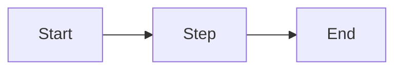

# PRD {{NUMBER}}: {{TITLE}}

**Status:** draft
**Owner:** {{OWNER}}
**Created:** {{DATE}}
**Issue:** #{{NUMBER}}
**Approved-by:** pending
**Plan checksum:** pending

> Approval semantics: while Status is `draft` the body below is editable
> in place. Once `/prd approve {{NUMBER}}` is run, the body is sealed —
> `Approved-by:` records the approver + timestamp and `Plan checksum:`
> records sha256 of the body (sections from `## Context` onward). After
> sealing, any change must go through `/prd amend {{NUMBER}}` which logs
> the diff to `decisions.md` and reverts Status to `draft` pending fresh
> approval.

## Context

Why now? What prompted this? What's the background a reader needs to understand this PRD without reading other docs?

## Problem

The concrete user or system pain. One to three paragraphs. Avoid solutions here — only the problem.

## Goals

- What this PRD explicitly aims to achieve (outcome, not implementation)
- Keep to 3–5 bullets
- Each goal should be independently verifiable

## Non-Goals

- What this PRD explicitly does NOT aim to address
- Scoping tool — the things you'd be tempted to include but are deferring
- Link out to a follow-up PRD if the non-goal is important enough to track

## Proposed Approach

High-level design. How the solution will work, not the line-by-line implementation. Include diagrams when data flow or state transitions matter.

### Key decisions

Bullet the non-obvious design choices you're locking in. Each choice goes in the Decision Log below when it's actually made.

## Milestones

Rough phasing. This is NOT a Gantt chart or sprint plan — it's the natural order of work with exit criteria for each phase.

- **M1 — <name>**: <exit criteria>
- **M2 — <name>**: <exit criteria>
- **M3 — <name>**: <exit criteria>

## Open Questions

Questions that are blocking or worth surfacing. Each question carries an
`[Answer]:` tag — fill it in before requesting approval. Resolved answers
that are real decisions also get an entry in the Decision Log below.

- **Q1:** _question_
  - [Answer]: _pending_
- **Q2:** _question_
  - [Answer]: _pending_

## Decision Log

Append-only. Every meaningful choice goes here with date and reason.

### {{DATE}} — Initial PRD created

- **Context:** <what situation prompted the decision>
- **Options considered:** <alternatives>
- **Chose:** <the pick>
- **Reason:** <why>

## Links

- Related PRDs: —
- Related issues: —
- Related PRs: —
- Prior art: —
